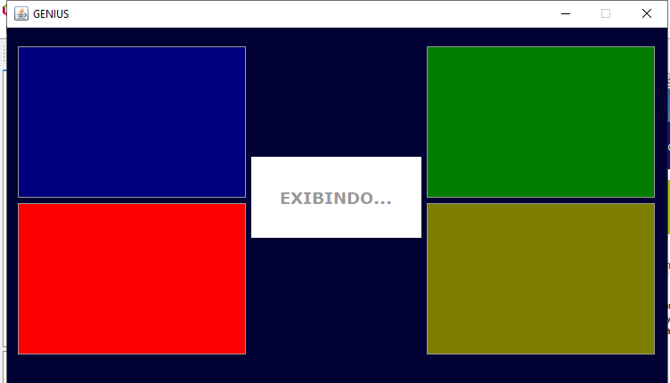

# Genius - Java

Atividade prática da disciplina de Programação Orientada a Objetos da 🏫 Universidade Federal de Viçosa - Campus Florestal. 

Este trabalho teve como objetivo de desenvolver um jogo baseado no jogo real GENIUS. O jogo tem um total de 8 rodadas, e a cada rodada o jogador teria alguns segundos para adivinhar a sequência de cores antes que o tempo acabasse. 

### 💻 Interface 

Abaixo temos a interface do jogo.




********************************************


## 🚀 Começando

Para obter uma cópia deste projeto:

```shell
git clone https://github.com/adrianomqsmts/Genius-Java
cd Genius-Java
```
## 🛠️ Construído com

Ferramentas, linguagens e outras tecnologias usadas no desenvolvimento deste sistema.

* [NetBeans](https://netbeans.apache.org/) - Ambiente de Desenvolvimento
* [Git](https://git-scm.com/) - Controle de Versões
* [GUI Swing](https://docs.oracle.com/javase/tutorial/uiswing/learn/index.html) - Biblioteca de Interface integrada do NetBeans

## ✒️ Autores

* **Desenvolvedor** - *Código e Documentação* - [Adriano](https://github.com/adrianomqsmts)

## 📄 Licença

Este projeto está sob a licença MIT License - veja o arquivo [LICENSE.md](https://github.com/adrianomqsmts/Genius-Java/blob/master/LICENSE) para detalhes.

---
